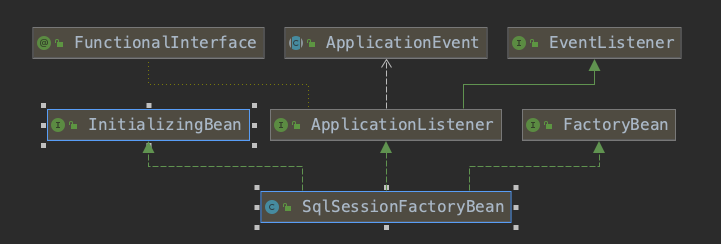
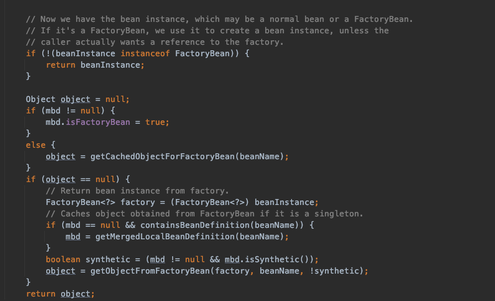
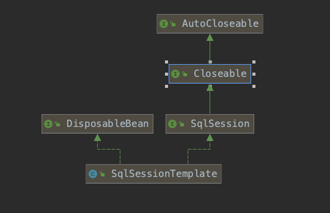
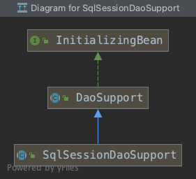

# Mybatis 原理讲解

> 1、Mybatis 官方链接地址 https://mybatis.org/mybatis-3/zh/index.html
>
> 2、Mybatis-Spring官方链接地址 http://mybatis.org/spring/zh/index.html
>
> 2、本文主要根据Mybatis官方提供的文章进行编写，将会简明概要的去描述mybatis关键的部分，可能对一些xml文件的配置会进行一些略过，主要是以干货为主。

1. 什么是 MyBatis？

   MyBatis 是一款优秀的持久层框架，它支持自定义 SQL、存储过程以及高级映射。MyBatis 免除了几乎所有的 JDBC 代码以及设置参数和获取结果集的工作。MyBatis 可以通过简单的 XML 或注解来配置和映射原始类型、接口和 Java POJO（Plain Old Java Objects，普通老式 Java 对象）为数据库中的记录。—摘自 Mybatis官方文档

2. Mybatis配置

   1. 全局XML配置文件，包含影响MyBatis行为的设置和属性。首先我们从官方文档上面能看到，Mybatis的全局配置xml文档的头部

      ```xml-dtd
      <?xml version="1.0" encoding="UTF-8" ?>
      <!DOCTYPE configuration
              PUBLIC "-//mybatis.org//DTD Config 3.0//EN"
              "http://mybatis.org/dtd/mybatis-3-config.dtd">
      <configuration>
      	<properties resource="mybatis/mybatis.properties"/>
          <environments default="dev">
              <environment id="dev">
                  <transactionManager type="JDBC"/>
                  <dataSource type="POOLED">
                      <property name="driver" value="${jdbc.driver}"/>
                      <property name="url" value="${jdbc.url}"/>
                      <property name="username" value="${jdbc.username}"/>
                      <property name="password" value="${jdbc.password}"/>
                  </dataSource>
              </environment>
          </environments>
          <mappers>
              <mapper resource="mybatis/mappers/UserMapper.xml"/>
          </mappers>
      </configuration>
      ```

      从文档的头部能看到mybatis全局配置文件的约束方式是`DTD：Document Type Definition`格式，主要根据http://mybatis.org/dtd/mybatis-3-config.dtd 文件

      ```xml-dtd
      <!ELEMENT configuration (properties?, settings?, typeAliases?, typeHandlers?, objectFactory?, objectWrapperFactory?, reflectorFactory?, plugins?, environments?, databaseIdProvider?, mappers?)>
      
      ```

      我们能看到头部的定义是约束我们mybatis全局配置的`elementxml`元素，从`configuration`我们能够使用idea查询mybatis的中的对应的配置类是 `org.apache.ibatis.session.Configuration` ，从 `configuration`类中我们能看到在创建 `configuration`类时会进行初始化，在初始化的时候就会加载对应的`element`元素对象，整体细节我们后面会进行源码解析。

      更多配置可以参考`mybatis`[官方文档](https://mybatis.org/mybatis-3/zh/configuration.html)

   2. SQL Mapper XML配置文件，用于映射SQL 模板语句与Java类型的配置。Mybatis的语句映射主要就是根据Mapper XML文件来进行一一对应，我们先看一下xml文档配置头部

      ```xml-dtd
      <!DOCTYPE mapper
              PUBLIC "-//mybatis.org//DTD Mapper 3.0//EN"
              "http://mybatis.org/dtd/mybatis-3-mapper.dtd">
      <mapper>
      
      </mapper>
      ```

      从文档的头部能看到`mybatis sql mapper`的约束方式也是`DTD：Document Type Definition`格式，主要根据http://mybatis.org/dtd/mybatis-3-mapper.dtd 文件

      ```xml-dtd
      <!ELEMENT mapper (cache-ref | cache | resultMap* | parameterMap* | sql* | insert* | update* | delete* | select* )+>
      <!ATTLIST mapper
      namespace CDATA #IMPLIED
      >
      ```

      从`DTD`约束文件中我们能发现在当前的`SQLMapper`文件里面能够编写对数据库表的 增删改查操作，还有针对当前`SQLMapper`的`cache`的二级缓存启用，`resultMap`返回值转`JavaBean`对象的操作，`parameterMap`对象已经废弃可以使用  `parameterType`属性进行SQL传参，而当前的`mapper`文件需要引入到`mybatis`全局配置文件中的 `mappers`对应的`element xml元素`在进行build的时候会进行对应的解析，整体细节我们后面会进行源码解析。

   3. SQL Mapper Annotation，是Java Annotation的方式替代SQL Mapper XML配置文件。

      > 设计初期的 MyBatis 是一个 XML 驱动的框架。配置信息是基于 XML 的，映射语句也是定义在 XML 中的。而在 MyBatis 3 中，我们提供了其它的配置方式。MyBatis 3 构建在全面且强大的基于 Java 语言的配置 API 之上。它是 XML 和注解配置的基础。注解提供了一种简单且低成本的方式来实现简单的映射语句。
      >
      > **提示** 不幸的是，Java 注解的表达能力和灵活性十分有限。尽管我们花了很多时间在调查、设计和试验上，但最强大的 MyBatis 映射并不能用注解来构建——我们真没开玩笑。而 C# 属性就没有这些限制，因此 MyBatis.NET 的配置会比 XML 有更大的选择余地。虽说如此，基于 Java 注解的配置还是有它的好处的。

3. Mybatis执行操作对象

   1. 使用 MyBatis 的主要 Java 接口就是 `SqlSession`。你可以通过这个接口来执行命令，获取映射器示例和管理事务。在介绍 `SqlSession` 接口之前，我们先来了解如何获取一个 `SqlSession` 实例。`SqlSessions` 是由 `SqlSessionFactory` 实例创建的。`SqlSessionFactory` 对象包含创建 `SqlSession` 实例的各种方法。而 `SqlSessionFactory` 本身是由 `SqlSessionFactoryBuilder` 创建的，它可以从 `XML`、注解或 `Java` 配置代码来创建 `SqlSessionFactory`。

      **提示** 当 Mybatis 与一些依赖注入框架（如 Spring 或者 Guice）搭配使用时，`SqlSession` 将被依赖注入框架创建并注入，所以你不需要使用 `SqlSessionFactoryBuilder` 或者 `SqlSessionFactory`。

   2. `SqlSessionFactoryBuilder` ->`SqlSessionFactory`->  `SqlSession` 这三个对象的关系是一环套一环的，我们在最初不使用Spring去管理 `SqlSessionFactory`时，纯JavaAPI编程的方式调用是下面的步骤

      ```java
      /**
      * 1.首先 SqlSessionFactoryBuilder 需要加载Mybatis全局配置文件根据 
      * 2.SqlSessionFactoryBuilder 对象会使用build模式去创建出 SqlSessionFactory 工厂类
      * 3.SqlSessionFactory 工厂类会根据Mybatis全局配置文件去创建出相应的 sqlSession，根据对应的配置可以去判读开启的sqlSession是什么样的事务类型
      * 4.我们根据sqlSession就可以去执行我们加载过的SQL Mapper statement模板 sql语句进行相应的数据库sql语句执行
      * 5.最后关闭掉sqlSession 释放资源
      */
      ResourceLoader resourceLoader = new DefaultResourceLoader();
      Resource resource = resourceLoader.getResource("classpath:/mybatis/mybatis-config.xml");
      EncodedResource encodedResource = new EncodedResource(resource, "UTF-8");
      Reader reader = encodedResource.getReader();
      SqlSessionFactoryBuilder builder = new SqlSessionFactoryBuilder();
      SqlSessionFactory sqlSessionFactory = builder.build(reader, "dev", new Properties());
      SqlSession sqlSession = sqlSessionFactory.openSession();
      User user = sqlSession.selectOne("User.selectById", 1);
      System.out.println(user);
      sqlSession.close();
      
      ```

   3. SqlSessionFactoryBuilder

      1. SqlSessionFactoryBuilder 有九个 build() 方法，每一种都允许你从不同的资源中创建一个 SqlSessionFactory 实例。

         ```java
         SqlSessionFactory build(InputStream inputStream)
         SqlSessionFactory build(InputStream inputStream, String environment)
         SqlSessionFactory build(InputStream inputStream, Properties properties)
         SqlSessionFactory build(InputStream inputStream, String env, Properties props)
         SqlSessionFactory build(Reader reader)
         SqlSessionFactory build(Reader reader, String environment)
         SqlSessionFactory build(Reader reader, Properties properties)
         SqlSessionFactory build(Reader reader, String environment, Properties properties)
         SqlSessionFactory build(Configuration config)
         ```

         我们从这九个方法中能发现无论是 `InputStream`还是 `Reader` 都是需要加载一个资源流，所以 `SqlSessionFactoryBuilder`对象主要就是去解析我们Mybatis全局xml配置文件。如果你调用了带 `environment` 参数的 `build` 方法，那么 MyBatis 将使用该环境对应的配置。当然，如果你指定了一个无效的环境，会收到错误。如果你调用了不带 `environment` 参数的 build 方法，那么就会使用默认的环境配置（在上面的示例中，通过 default="dev" 指定了默认环境）。如果你调用了接受 `properties` 实例的方法，那么 MyBatis 就会加载这些属性，并在配置中提供使用。绝大多数场合下，可以用 `${propName}` 形式引用这些配置值。最后一个 `build` 方法接受一个 `Configuration` 实例。`Configuration` 类包含了对一个 `SqlSessionFactory` 实例你可能关心的所有内容。在检查配置时，`Configuration` 类很有用，它允许你查找和操纵 SQL 映射（但当应用开始接收请求时不推荐使用）。你之前学习过的所有配置开关都存在于 `Configuration` 类，只不过它们是以 Java API 形式暴露的。
      
   4. SqlSessionFactory
   
      1. SqlSessionFactory 有六个方法创建 SqlSession 实例。通常来说，当你选择其中一个方法时，你需要考虑以下几点：
   
         - **事务处理**：你希望在 session 作用域中使用事务作用域，还是使用自动提交（auto-commit）？（对很多数据库和/或 JDBC 驱动来说，等同于关闭事务支持）
         - **数据库连接**：你希望 MyBatis 帮你从已配置的数据源获取连接，还是使用自己提供的连接？
         - **语句执行**：你希望 MyBatis 复用 PreparedStatement 和/或批量更新语句（包括插入语句和删除语句）吗？
   
         ```Java
         SqlSession openSession();
         SqlSession openSession(boolean autoCommit);
         SqlSession openSession(Connection connection);
         SqlSession openSession(TransactionIsolationLevel level);
         SqlSession openSession(ExecutorType execType);
         SqlSession openSession(ExecutorType execType, boolean autoCommit);
         SqlSession openSession(ExecutorType execType, TransactionIsolationLevel level);
         SqlSession openSession(ExecutorType execType, Connection connection);
         ```
   
         默认的 `openSession()` 方法没有参数，它会创建具备如下特性的 SqlSession：
         
         - 事务作用域将会开启（也就是不自动提交）。
         - 将由当前环境配置的 `DataSource` 实例中获取 `Connection` 对象。
         - 事务隔离级别将会使用驱动或数据源的默认设置。
         - 预处理语句不会被复用，也不会批量处理更新。
         
         这个`openSession`方法主要是用于创建`SqlSession`，而`sqlSession`是针对数据库进行执行的对象，所以就会有数据库事务的一个处理。对于事务隔离级别，MyBatis 使用了一个 Java 枚举包装器来表示，称为 `TransactionIsolationLevel` 事务隔离级别支持 JDBC 的五个隔离级别（`NONE`、`READ_UNCOMMITTED`、`READ_COMMITTED`、`REPEATABLE_READ` 和 `SERIALIZABLE`），并且与预期的行为一致。
         
         你可能对 `ExecutorType` 参数感到陌生。这个枚举类型定义了三个值:
         
         - `ExecutorType.SIMPLE`：该类型的执行器没有特别的行为。它为每个语句的执行创建一个新的预处理语句。
         - `ExecutorType.REUSE`：该类型的执行器会复用预处理语句。
         - `ExecutorType.BATCH`：该类型的执行器会批量执行所有更新语句，如果 SELECT 在多个更新中间执行，将在必要时将多条更新语句分隔开来，以方便理解。
   
   5. SqlSession
   
      1. 上面我们多次提到`SqlSession`，而它也是Mybatis中是非常强大的一个类。它包含了所有执行语句、提交或回滚事务以及获取映射器实例的方法。SqlSession 类的方法超过了 20 个，我们只需要去记住一些数据库操作的方法就可以
   
         这些方法被用来执行定义在 SQL 映射 XML 文件中的 SELECT、INSERT、UPDATE 和 DELETE 语句。你可以通过名字快速了解它们的作用，每一方法都接受语句的 ID 以及参数对象，参数可以是原始类型（支持自动装箱或包装类）、JavaBean、POJO 或 Map。
   
         ```java
   <T> T selectOne(String statement, Object parameter)
           
         <E> List<E> selectList(String statement, Object parameter)
           
         <T> Cursor<T> selectCursor(String statement, Object parameter)
           
         <K,V> Map<K,V> selectMap(String statement, Object parameter, String mapKey)
           
         int insert(String statement, Object parameter)
           
         int update(String statement, Object parameter)
           
         int delete(String statement, Object parameter)
           
           
         ```
      
   6. 总结
   
      1. 以上我们讨论了Mybatis底层的执行语句与xml配置文件，其实Mybatis的配置属性有很多，我还是建议大家到Mybatis[官方文档](https://mybatis.org/mybatis-3/zh/configuration.html)去查询有助于自己更好的去了解，但是我们在一般的开发过程中，以上的方式去使用mybatis是很繁琐的，所以后面我们会整合`Spring`包括`SpringBoot` 简化我们的日常开发。还有一些比如mybatis二级缓存，对于一些不经常使用的配置我们在这里就不做过多的讲解，主要去讲解大家在工作中日常用到的。
   
4. MyBatis-Spring  利用了`Spring IOC 容器`的特性使用 `SqlSessionFactoryBean` 来帮助Mybatis自动创建 `SqlSessionFactory`根据 `sqlSession`的常用方法生成了 `SqlSessionTemplate`模板，并且根据 `SpringAop`切面特性用来做数据库事务处理，针对SQLMapper的绑定也提供了 `MapperFactoryBean`对象来进行绑定对应的sql语句，下面我们将进行源码分析。

   1. SqlSessionFactoryBean

      1. `SqlSessionFactoryBean`我们观察这个类实现了那些接口

         

         * 我们能看到当前类实现了 `Spring`的三个接口 `InitializingBean 初始化Bean` `FactoryBean<SqlSessionFactory> bean工厂提供 getObject()方法获取 SqlSessionFactory ` `ApplicationListener<ApplicationEvent> spring事件监听接口` 
         * 通过实现 `InitializingBean `接口保证当前类注册成为 `SpringBean`能够让 `Spring IOC` 容器进行管理，并且在 `bean`初始化完成之后立即去调用 `buildSqlSessionFactory`方法初始化 `SqlSessionFactory`，并且在调用该方法之前就去验证了 `DataSource`是否存在，确保数据库连接正确
         * 实现 `FactoryBean<SqlSessionFactory>`接口使当前类变成一个只提供 `SqlSessionFactory`对象的工厂类，在 调用`getObject()`方法是进行获取  `SqlSessionFactory` 对象
         * 实现 `ApplicationListener<ApplicationEvent>`接口主要是监听 `Spring`应用上下文 `ContextRefreshedEvent`操作，主要用于 `fail-fast -> check all statements are completed`

      2. 根据以上解析，我们可以在 `Spring`框架中去配置与使用 `SqlSessionFactory`，使用xml方式配置

         1. 首先我们需要创建一下创建 `Spring`需要的xml文件

            ```xml-dtd
            <bean id="property_config"   	    class="org.springframework.beans.factory.config.PropertyPlaceholderConfigurer">
            	<property name="locations">
               	<list>
                 	<value>classpath:/mybatis/mybatis.properties</value>
               	</list>
             	</property>
            </bean>
            <!-- 数据库连接 -->
            <bean id="dataSource" class="com.alibaba.druid.pool.DruidDataSource"
            destroy-method="close">
              <property name="driverClassName" value="${jdbc.driver}"/>
              <property name="url" value="${jdbc.url}"/>
              <property name="username" value="${jdbc.username}"/>
              <property name="password" value="${jdbc.password}"/>
              <property name="initialSize" value="20"/>
            </bean>
            <bean id="sqlSessionFactory" 		 class="org.mybatis.spring.SqlSessionFactoryBean">
            	<property name="dataSource" ref="dataSource" />
            </bean>
            ```

            根据 `SqlSessionFactoryBean#afterPropertiesSet`方法我们知道创建  `SqlSessionFactoryBean`需要先配置 `DataSource`,所以在当前的 `Spring`配置文件中引入了之前的数据库配置文件 `mybatis.properties`用于配置数据库 `DataSource`数据源，以上配置都完成之后，我们就需要使用 API的方式去获取一下 `SqlSessionFactoryBean`

         2. Java 编程获取`SqlSessionFactoryBean`

            ```java
             ClassPathXmlApplicationContext context = new  ClassPathXmlApplicationContext(
                            "classpath:/mybatis/spring-config.xml");
            Object sqlSessionFactoryBean = context.getBean("sqlSessionFactory");
            System.err.println("sqlSessionFactoryBean：" + sqlSessionFactoryBean);
            context.close();
            ```

            ```
            sqlSessionFactoryBean：org.apache.ibatis.session.defaults.DefaultSqlSessionFactory@6580cfdd
            
            ```

            通过我们的 `main`方法我们获取到了 `SqlSessionFactoryBean`，但是我们在控制台中输出的对象却是 `DefaultSqlSessionFactory`不是 `SqlSessionFactoryBean`，为此我们就将有疑问了，为什么我定义的 `bean`对象和我 `getBean`获取到的对象不是同一个呢？这时候我们就要去了解一些 `Spring`的一些源码

            从 `org.springframework.beans.factory.support.AbstractBeanFactory#getObjectForBeanInstance`方法中我们能够看到

            

            如果当前的 `bean`是 `FactoryBean`那么就会去直接调用` getObjectFromFactoryBean()`方法，再到底层调用 `org.springframework.beans.factory.support.FactoryBeanRegistrySupport#doGetObjectFromFactoryBean`方法，

            最终还是去获取 `org.springframework.beans.factory.FactoryBean#getObject`方法，当然在获取之前还会去判断一下 `org.springframework.beans.factory.support.FactoryBeanRegistrySupport#factoryBeanObjectCache`缓存里面是否存在已经初始化好的 `bean`：  `Cache of singleton objects created by FactoryBeans: FactoryBean name to object`

            根据这段源码解析，我们知道了在进行 `getBean()` 获取`FactoryBean`的操作时最后获取的对象是 调用 `org.springframework.beans.factory.FactoryBean#getObject`方法进行最终获取

   2. SqlSessionTemplate

      1. `SqlSessionTemplate`对象相对比较简单一些主要用于 `SqlSession`模板调用，先观察一下实现了那些接口

         

         我们从图上能够看到 `SqlSessionTemplate`对象实现的主要的接口就是 `SqlSession`接口 ，`DisposableBean`是`Spring`的 `bean`销毁时提供的接口

      2. 我们去看 `SqlSessionTemplate`对象里面的本身自带参数与方法

         ```java
         private final SqlSessionFactory sqlSessionFactory; // sqlSession
         private final ExecutorType executorType; // sqlSession 执行器行为 默认 SIMPLE
         private final SqlSession sqlSessionProxy; // sqlSession 代理对象 主要创建为SqlSessionInterceptor
         
         private final PersistenceExceptionTranslator exceptionTranslator; // 由Spring集成的接口与抛出运行时异常的数据访问技术（例如JPA和Hibernate）一起实现。
         
         public SqlSessionTemplate(SqlSessionFactory sqlSessionFactory) {
             this(sqlSessionFactory, 		       sqlSessionFactory.getConfiguration().getDefaultExecutorType());
         }
         
         public SqlSessionTemplate(SqlSessionFactory sqlSessionFactory, ExecutorType executorType) {
             this(sqlSessionFactory, executorType,
                 new MyBatisExceptionTranslator(           sqlSessionFactory.getConfiguration().getEnvironment().getDataSource(), true));
         }
         
         private class SqlSessionInterceptor implements InvocationHandler {
           ....
         }
         ```

         从 `SqlSessionTemplate`对象里面的自带的参数与类构造器我们能够发现里面的配置参数最主要还是 `SqlSessionFactory`，因为其他的参数都有默认参数，所以我们创建 `SqlSessionTemplate`的时候主要还是使用 `SqlSessionTemplate(SqlSessionFactory sqlSessionFactory)`构造器，如果要是需要一些自己的配置修改，也可以根据自己需求进行自行调用创建。

      3. 根据以上解析，我们可以在 `Spring`框架中去配置与使用 `SqlSessionTemplate`，使用xml方式配置

         1. 我们在刚才的`Spring xml 配置文件`里面新增一个 `bean`

            ```xml-dtd
            <bean id="sessionTemplate" class="org.mybatis.spring.SqlSessionTemplate">
               <constructor-arg index="0" ref="sqlSessionFactory" />
            </bean>
            ```

            我们使用 `SqlSessionTemplate(SqlSessionFactory sqlSessionFactory)`构造器去创建一个 `SqlSessionTemplate`，将我们之前的 `sqlSessionFactory`作为参数注入到构造器

         2. Java api 获取 `SqlSessionTemplate`

            ```java
            ClassPathXmlApplicationContext context = new ClassPathXmlApplicationContext("classpath:/mybatis/spring-config.xml");
            
            DefaultSqlSessionFactory sqlSessionFactoryBean = (DefaultSqlSessionFactory) context.getBean("sqlSessionFactory");
            
            System.out.println("sqlSessionFactoryBean:" + sqlSessionFactoryBean);
            SqlSessionTemplate sqlSessionTemplate = context.getBean("sessionTemplate", SqlSessionTemplate.class);
            
            System.out.println("sqlSessionTemplate:" + sqlSessionTemplate);
            context.close();
            ```

            根据之前的代码，我们只需要在后面多加一个 `getBean`操作即可最后看输出的 `class`类名

            ```Java
            sqlSessionFactoryBean:org.apache.ibatis.session.defaults.DefaultSqlSessionFactory@6580cfdd
              
            sqlSessionTemplate:org.mybatis.spring.SqlSessionTemplate@7e0b85f9
            ```

   3. SqlSessionDaoSupport

      1. 我们在进行mybatis执行SQL语句是，都是自己手动去打开 `openSession`与构造 `sqlSessionTemplate`来进行执行sql语句，那么接下来我们要讲的 `SqlSessionDaoSupport`就是为了让我们不需要手动去操作 `SqlSession`，让我们的代码更多的去关注业务层面，而不用把时间一直浪费在这些耗时的操作上。我们也先看一下 `SqlSessionDaoSupport`的类继承关系
   
         
   
         我们能够看到 `SqlSessionDaoSupport`也是一个 `Bean`因为 `SqlSessionDaoSupport`继承了 `DaoSupport`而 `DaoSupport`实现了 `InitializingBean`接口，所以根据Java语言特性，我们的 `SqlSessionDaoSupport`也会有 `InitializingBean`的特性，但是我们看到 `SqlSessionDaoSupport`是一个抽象类，而我们也能发现 `MapperFactoryBean<T>`继承了当前的 `SqlSessionDaoSupport`，所以我们能知道我们最后的使用的类是哪一个。从 `MapperFactoryBean<T>`类的名称我们能知道，这是一个 `Mapper`的 `BeanFactory` ，那么我们可以进行联想到我们之前写的 `SQLMapper xml`文件，我们是不是可以进行整合使用呢？答案是 肯定的。
   
      2. 首先我们需要把我们之前的 `spring-config.xml`修改一下
   
         ```xml-dtd
          <bean id="sqlSessionFactory" class="org.mybatis.spring.SqlSessionFactoryBean">
                 <property name="dataSource" ref="dataSource" />
                 <property name="mapperLocations" value="mybatis/mappers/UserMapper.xml"/> <!-- 注册 SQLMapper xml资源   -->
             </bean>
         
         
         <bean id="userMapper" class="org.mybatis.spring.mapper.MapperFactoryBean">
                 <property name="mapperInterface" value="com.phoenix.nirvana.mybatis.config.bootstrap.mapper.UserMapper" />
                 <property name="sqlSessionFactory" ref="sqlSessionFactory" />
         </bean> <!--  将我们对应的Mapper interface 添加到 MapperFactoryBean中  -->
         ```
   
      3. 在我们的配置文件中我们将 `UserMapper.xml`配置到了 `SqlSessionFactoryBean`的 `mapperLocations`属性，那么我们又把 `userMapper`放入到了 `MapperFactoryBean`里面，我们会好奇，这两点有什么关联呢？我们在引入 `UserMapper.xml`之前我们把 `UserMapper.xml`文件里面 `namespace` `element`属性进行了一个修改，修改成 `com.phoenix.nirvana.mybatis.config.bootstrap.mapper.UserMapper`这个是我们 `UserMapper interfance`接口的全类名，而且在 `UserMapper`接口中的定义的 `selectById()`方法与 `UserMapper.xml`文件中的 `select` `element`元素中的 `id`字段值相同，为此我们可以产生了一个答案，是不是我们的 `UserMapper`接口全类名加上执行方法名称就是我们 `UserMapper.xml 中的 namespace + select element id`就可以进行查询到了呢？答案是确定的。
      
      4. 我们在进行断点调试发现 `org.apache.ibatis.binding.MapperMethod.SqlCommand#resolveMappedStatement`方法就是去组织 `User interface`接口的 `MappedStatement`模板，根据 `String statementId = mapperInterface.getName() + "." + methodName;`获取  `statementId`然后去获取 `configuration.getMappedStatement(statementId)` 我们可以发现我们的所以的 `statement`都是在 `org.apache.ibatis.session.Configuration#mappedStatements`参数里面，为此我们能够知道两者之间的确实是用  接口全类名+方法名称 进行去匹配 SQLMapper xml文件里面对应的执行语句的。我们知道了，在执行 `mapper`方法调用时候去匹配 `mappedStatement`，那么我们的 `SQLMapper xml`文件是什么时候去添加到 `org.apache.ibatis.session.Configuration#mappedStatements`里面的呢？这时候我们就要去查看 `SqlSessionFactoryBean`类，我们在 `spring-config.xml`文件中添加了一个 `mapperLocations`参数，那么`spring`调用`buildSqlSessionFactory()`时对应的 `mapperLocations`参数的解析我们继续源码解析。
      
      5. 我们知道 `mapperLocations`是一个数组 `Resource`资源对象，那么就会有一个循环操作，在这个资源对象里面全部存放的是 `SQLMapper xml`文件，所以我们需要去解析 `xml`资源，`org.apache.ibatis.builder.xml.XMLMapperBuilder#parse`这个方法就是去解析 `SQLMapper xml`在方法调用是我们进行断点调试发现 `org.apache.ibatis.builder.MapperBuilderAssistant#addMappedStatement(java.lang.String, org.apache.ibatis.mapping.SqlSource, org.apache.ibatis.mapping.StatementType, org.apache.ibatis.mapping.SqlCommandType, java.lang.Integer, java.lang.Integer, java.lang.String, java.lang.Class<?>, java.lang.String, java.lang.Class<?>, org.apache.ibatis.mapping.ResultSetType, boolean, boolean, boolean, org.apache.ibatis.executor.keygen.KeyGenerator, java.lang.String, java.lang.String, java.lang.String, org.apache.ibatis.scripting.LanguageDriver, java.lang.String)`里面调用了 `MappedStatement.Builder.build()`进行创建了`MappedStatement`然后添加到 `org.apache.ibatis.session.Configuration#mappedStatements`，到此我们所讨论  `Mapper interface`接口方法与 `SQLMapper xml`两者之间的绑定关系就已经揭开了神秘的面纱，其中还有一些对应的 `element`元素都有进行解析，因为篇幅原因就暂不讨论。
      
   4. MapperScan
   
      1. 经过上面的一些篇幅讨论我们都是单个的 `Mapper`的操作，那么如果要是批量的 `Mapper`怎么去全部的导入进来呢？当然我们可以使用 `MapperFactoryBean`进行操作，但是在批量的情况下未免会有一些漏掉的情况，导致出现bug，所以为了避免这个问题，`Mybatis-Spring`为我们提供了 `MapperScan`,而且在批量的 `SQLMapper xml`文件下怎么样去批量的导入呢？接下来我们来分析一下。
   
      2. 首先我们先看一下 `xml`方式下我们怎么样去操作，我们先将xml文件修改一下
   
         ```xml-dtd
         xmlns:mybatis="http://mybatis.org/schema/mybatis-spring"
         http://mybatis.org/schema/mybatis-spring 
         http://mybatis.org/schema/mybatis-spring.xsd
         
         <mybatis:scan base-package="org.mybatis.spring.sample.mapper" />
         ```
   
      3. 我们能够看到我们在 `spring-config.xml`文件中增加了三个 `mybatis`约束根据这些约束我们能知道，这一次的 `mybatis`用的是 `spring`的另一个扩展点`org.springframework.beans.factory.xml.BeanDefinitionParser`，解析 `<mybatis:`标签元素，所以我们只要在 `mybatis-spring`中有哪些类实现了 `BeanDefinitionParser`接口就可以了，由此我们找到了 `org.mybatis.spring.config.MapperScannerBeanDefinitionParser`类，我们可以验证一下是否正确
      
         ```java
         private static final String ATTRIBUTE_BASE_PACKAGE = "base-package";
         private static final String ATTRIBUTE_ANNOTATION = "annotation";
         private static final String ATTRIBUTE_MARKER_INTERFACE = "marker-interface";
         private static final String ATTRIBUTE_NAME_GENERATOR = "name-generator";
         private static final String ATTRIBUTE_TEMPLATE_REF = "template-ref";
         private static final String ATTRIBUTE_FACTORY_REF = "factory-ref";
         ```
      
         从 `MapperScannerBeanDefinitionParser`类中发现当前解析的 `element`元素与我们 `xml`中的元素一样，从代码中我们能够看到最后的 `base-package`是由 `org.mybatis.spring.mapper.ClassPathMapperScanner`来进行 `bean`注册操作的。由此我们知道了，`<mybatis:scan base-package=''/>`解析的整体脉络 `MapperScannerBeanDefinitionParser`->`ClassPathMapperScanner`，从扩展 `spring`的 `xml`元素扩展机制，然后在去扩展 `ClassPathBeanDefinitionScanner`类去把当前扫描出来的 `Mapper interface`注册成 `BeanDefinitionHolder`然后在把当前的的 `beanClass`转换成 `MapperFactoryBean`然后将当前 `Mapper interface class`当成构造参数传入到 `org.mybatis.spring.mapper.MapperFactoryBean#MapperFactoryBean(java.lang.Class<T>)`方法中，由此做了一个 普通的 `Spring BeanDefinition`转换成 `  Mybatis MapperFactoryBean<T>`
         
         主要转换操作全部由 `org.mybatis.spring.mapper.ClassPathMapperScanner#processBeanDefinitions`完成
         
      4. 根据上面源码解析，我们再次执行查询
      
         ```java
         ClassPathXmlApplicationContext context = new ClassPathXmlApplicationContext("classpath:/mybatis/spring-config.xml");
         UserMapper userMapper = context.getBean("userMapper", UserMapper.class);
         User user = userMapper.selectById(1);
         System.out.println(user);
         context.close();
         ```
      
         ```
         13:13:11.427 [main] DEBUG com.phoenix.nirvana.mybatis.config.bootstrap.mapper.UserMapper.selectById - ==>  Preparing: select * from sys_user where ? 
         13:13:11.702 [main] DEBUG druid.sql.Statement - {conn-10020, pstmt-20000} created. select * from sys_user where ?
         13:13:11.744 [main] DEBUG com.phoenix.nirvana.mybatis.config.bootstrap.mapper.UserMapper.selectById - ==> Parameters: 1(Integer)
         
         User{id=1, userName='admin', phone='18252113278'}
         ```
      
      5. 我们发现也是可以进行执行成功的，由此我们 `mybatis-spring` 的源码解析就告一段落
   
5. 总结，以上我们从`mybatis`的源码解析在到 `mybatis-spring`源码解析，系统的分析了mybatis的组成对象

   1. `mybatis框架`主要脉络为 ：`SqlSessionFactoryBuild`—>`SqlSessionFactory`—>`SqlSession`—>`MappedStatement`—>`Executor`

      * `SqlSessionFactoryBuild`：加载 `Mybatis`全局配置文件，加载数据库连接，加载 `SQLMapper Statement`，加载相关 `element`元素配置项等

      * `SqlSessionFactory`：根据 `openSession()`方法选择开启对应的 `SqlSession`进行执行 `MappedStatement`
      * `MappedStatement`：主要用于映射 `SQLMapper xml`文件，根据 `namespace`与 `element 元素 id`来生成对应的模板对象
      * `Executor`：最终的 `SQL`执行器，针对数据库操作

   2. `mybatis-spring jar`包主要用于 `Spring`与`mybatis`之间的桥梁，通过`spring`的扩展机制将 `SqlSessionFactory`，`mapperScan`进行 `IOC`容器整合，让开发人员更专注与业务代码的开发，从而不用去顾虑 `sqlSession`与 `Mapper`的整体配置与开关

   3. 无论是 `mybatis`自身框架，还是 `Spring-Mybatis`的融合`jar`包，里面的东西还有很多，比如 Mybatis执行的一些动态代理，Spring针对事务处理的一些AOP实现等，下次有时间我们将会继续进行讲解。

   4. 小弟才疏学浅，若是有哪里写的不对或者解读不重复还请见谅，也欢迎大家到我的 [Git](https://github.com/Xyk859852/nirvana-reborn)上提问，我都会进行回答，若是能点点赞或者一键三连那就太棒了，比心。包括大家都可以提出想要看一些别的源码分析，小弟都会竭尽所能，知无不言言无不尽。谢谢大家。


